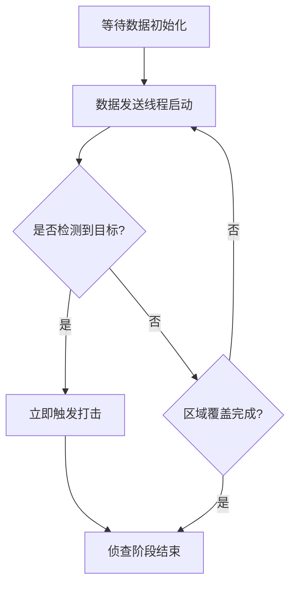
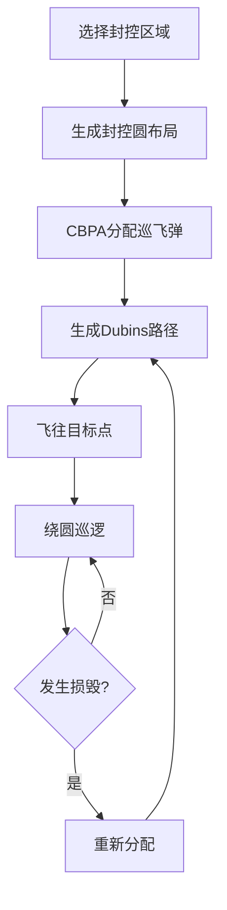

# OODA流程详解

本系统实现四阶段 OODA 打击任务：准备 → 侦查 → 打击 → 封控。

## 1. 准备阶段（编队分组分簇）

**目标**：将无人机按区域面积比例分配，并生成编队飞行路径。

**代码流程**：

```python
# 1. 按面积比例分配无人机到各区域
uav_allocation = divide_robot(RegionList, task_list, robot_list)

# 2. 生成区域覆盖路径（Fields2Cover）
region_conver_set = generate_region_conver_set(RegionList)

# 3. 生成GVF编队路径（向量场导航）
gvf_ode_set = generate_gvf_ode_set(uav_allocation, robot_list, RegionList)
```

**关键算法**：
- `divide_robot()`: 按区域面积比例分配无人机数量
- `RegionCover.cover_run()`: 使用Fields2Cover生成扫描覆盖路径
- `GVF_ode`: 广义向量场编队控制

## 2. 侦查阶段（覆盖式侦查）

**目标**：无人机按预定路径飞行，覆盖各自负责的矩形区域，检测敌方防空火力。

**代码流程** (`start_simulation.py:detect_step()`)：



**关键逻辑**：
- 无人机沿 `GVF_ode` 路径飞往目标区域
- 到达后按 `RegionCover` 路径进行区域扫描
- 检测到防空目标 (`task_type==2`) 时立即分配打击
- 支持随机损毁模拟和动态重分配

**时间记录**：
- `Detect_step_start_time`: 侦查开始时间
- `Detect_step_end_time_map`: 各区域覆盖完成时间
- `Cover_step_end_time_map`: 各区域实际覆盖完成时间
- `ReAllocationTime`: 损毁后重分配耗时

## 3. 打击阶段（CBPA任务分配）

**目标**：将存活的巡飞弹分配至侦查阶段探测到的敌方目标，执行精确打击。

**代码流程** (`start_simulation.py:attack_step()`)：

```python
# 筛选有效目标（排除已摧毁、防空任务）
task_list_valid = [t for t in task_list if t.task_status and t.task_id not in TaskDefenceList]

# CBPA集中式分配
attack_list, _, _, _, _ = xfd_allocation(robot_list, task_list_valid, WorldInfo)

# 发送打击指令
send_attack_data(Sim_IP, UAV_PORT, 5, attack_data_list)
```

**CBPA算法输入输出**：
- 输入: `RobotList`, `TaskList`, `WorldInfo`（世界边界）
- 输出: `attack_list [[target_id, uav_id, ...], ...]`

**打击任务类型需求**：

| 目标类型 | 任务类型值 | 所需巡飞弹数量 |
|---------|-----------|---------------|
| 高价值目标 | 0 | 4 |
| 中价值目标 | 1 | 3 |
| 防空目标 | 2 | 2 |
| 低价值目标 | 3 | 1 |
| 其他 | 4-7 | 2-3 |

## 4. 封控阶段（区域封控）

**目标**：在关键区域生成封控圆，防止敌方增援进入。

**代码流程** (`start_simulation.py:isolate_step()`)：



**关键算法**：
- `generate_circles_in_rectangle()`: 矩形区域圆填充算法
- `UavPath.calculate_path()`: 为每架无人机生成：
  1. 从当前位置到圆边缘的Dubins路径
  2. 圆上巡逻路径

**封控圆分布示例**：

```
┌─────────────────────────┐
│  ○    ○    ○    ○    ○  │
│    ○    ○    ○    ○    │
│  ○    ○    ○    ○    ○  │
└─────────────────────────┘
```

## 5. 效能评估指标

系统计算三类效能指标写入Excel：

| 指标 | 名称 | 计算公式 |
|------|------|----------|
| O1 | 目标识别效率 | `recognized_num / recognized_time` |
| D1 | 决策效率 | `w * Σ(e^(-r*t_arrived)) + (1-w) * Σ(e^(-r*t_attack))` |
| A1 | 打击效率 | `attack_num / max(attack_time)` |
