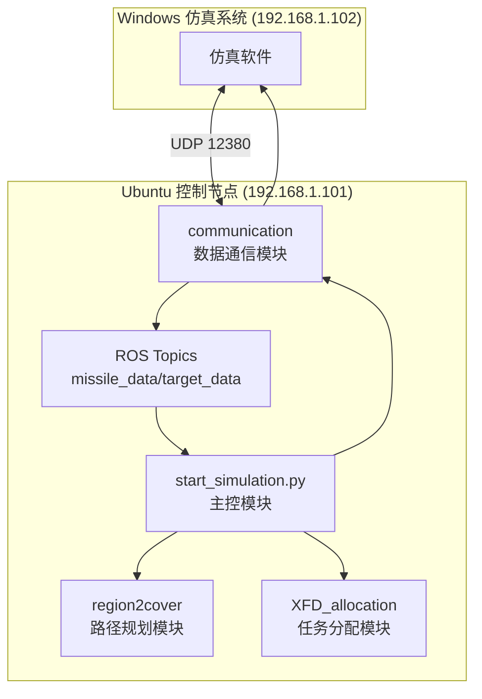
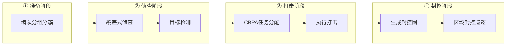
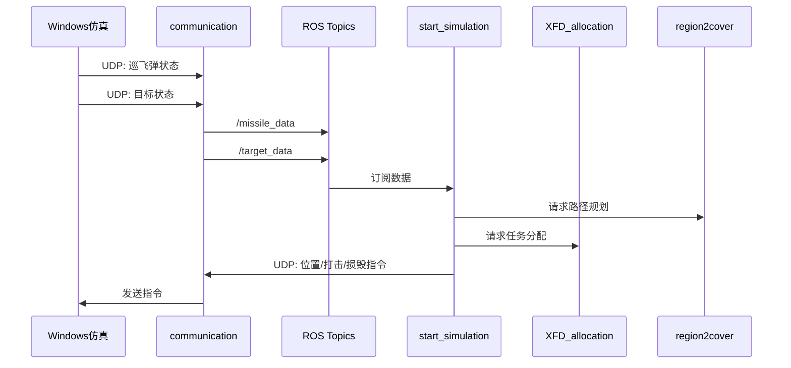

# 系统架构文档

## 1. 系统概述

智能集群弹药分布式感知虚拟仿真系统实现了完整的 OODA（Observe-Orient-Decide-Act）打击任务流程，协同管理巡飞弹与固定翼无人机编队完成区域封控作战任务。

## 2. 系统架构图

## 3. 模块职责

| 模块 | 职责 | 关键接口 |
|------|------|----------|
| `communication/` | 与Windows仿真系统UDP双向通信，收发巡飞弹状态与控制指令 | ROS Topics: `/missile_data`, `/target_data` UDP: `192.168.1.102:12380` |
| `region2cover/` | 区域覆盖路径规划、封控圆生成 | `RegionCover`, `UavPath`, `generate_circles_in_rectangle()` |
| `XFD_allocation/` | CBPA算法任务分配 | `CBPA_REC.solve_centralized()` |
| `group6_interface/` | ROS消息类型定义 | `AgentData`, `TargetData`, `RegionData` 等 |
| `start_simulation.py` | OODA流程编排、主控制逻辑 | - |

## 4. OODA流程映射

### 4.1 各阶段代码位置

| 阶段 | 主函数/类 | 文件位置 |
|------|----------|----------|
| 准备阶段 | `divide_robot()`, `generate_gvf_ode_set()`, `generate_region_conver_set()` | `start_simulation.py` |
| 侦查阶段 | `UavSimProcess.detect_step()` | `start_simulation.py:149-301` |
| 打击阶段 | `UavSimProcess.attack_step()` | `start_simulation.py:303-337` |
| 封控阶段 | `UavSimProcess.isolate_step()` | `start_simulation.py:339-515` |

## 5. 数据流

## 6. 关键数据模型

参见 [数据模型](../Modules/data-models.md)

## 7. 外部依赖

| 依赖 | 版本 | 用途 |
|------|------|------|
| ROS Noetic | - | 中间件、节点管理 |
| fields2cover | - | 覆盖路径规划 |
| or-tools | - | 优化算法 |
| numpy | - | 数值计算 |
| scipy | - | GVF常微分方程求解 |
