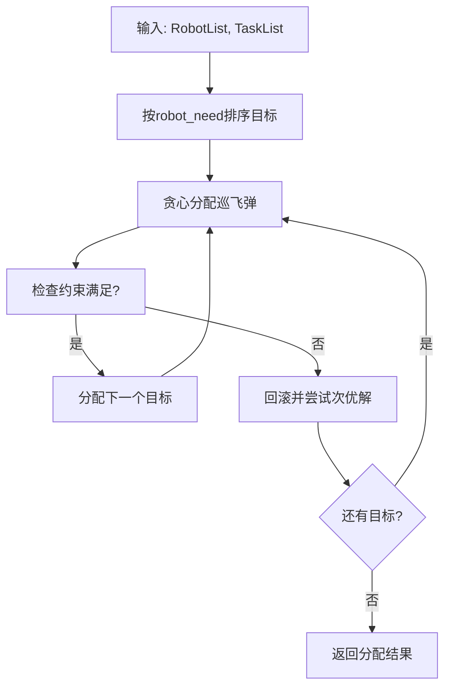

# XFD_allocation 模块

巡飞弹任务分配模块，实现了 CBPA（Consensus-Based Bundle Algorithm）及其变体算法。

## 概述

CBPA 是一种基于共识的捆绑算法，用于将多架巡飞弹分配至多个打击目标。

## 文件结构

```
XFD_allocation/
├── scripts/
│   ├── CBPA/
│   │   └── lib/
│   │       ├── CBPA.py       # 分布式CBPA算法
│   │       ├── CBPA_REC.py   # 集中式CBPA变体（推荐使用）
│   │       ├── Robot.py      # 巡飞弹数据类
│   │       ├── Task.py       # 目标数据类
│   │       ├── Region.py     # 区域数据类
│   │       ├── WorldInfo.py  # 世界边界数据类
│   │       └── HelperLibrary.py
│   └── mrta_server.py        # MRTA服务（备用）
└── setup.py
```

## CBPA_REC (集中式CBPA)

简化版集中式CBPA算法，用于主仿真流程中的任务分配。

**位置**：`CBPA/lib/CBPA_REC.py`

### 使用方法

```python
from XFD_allocation.scripts.CBPA.lib.CBPA_REC import CBPA_REC

solver = CBPA_REC()
path_list, idx_list, robot_list, task_list, score = solver.solve_centralized(
    robot_list,      # list[Robot]  可用巡飞弹列表
    task_list,       # list[Task]   待分配目标列表
    WorldInfoTest    # WorldInfo    世界边界
)
```

### 返回值

| 返回值 | 类型 | 说明 |
|--------|------|------|
| path_list | list | 分配结果 `[[target_id, uav_id1, uav_id2, ...], ...]` |
| idx_list | list | 各目标对应的巡飞弹索引 |
| robot_list | list | 更新后的巡飞弹列表 |
| task_list | list | 更新后的目标列表 |
| score | float | 分配得分 |

### 算法流程



## CBPA (分布式CBPA)

完整版分布式CBPA算法，包含多轮共识迭代。

**位置**：`CBPA/lib/CBPA.py`

### 与CBPA_REC的区别

| 特性 | CBPA | CBPA_REC |
|------|------|----------|
| 共识轮次 | 多轮迭代 | 单轮贪心 |
| 通信模式 | 分布式 | 集中式 |
| 适用场景 | 实际多机协同 | 仿真环境 |
| 复杂度 | O(k × n × m) | O(n × m × log m) |

### 主要方法

| 方法 | 说明 |
|------|------|
| `solve()` | 执行完整分布式CBPA |
| `bundle_construction()` | 捆绑构建阶段 |
| `consensus_phase()` | 共识阶段 |

## 数据模型

### Robot

参见 [数据模型](data-models.md#robot-巡飞弹无人机)

### Task

参见 [数据模型](data-models.md#task-敌方目标)

### WorldInfo

```python
@dataclass
class WorldInfo:
    limit_x: list  # [xmin, xmax]
    limit_y: list  # [ymin, ymax]
    limit_z: list  # [zmin, zmax]
```

## 分配结果示例

```python
# 输入
robot_list = [Robot(...), Robot(...), ...]  # 125架巡飞弹
task_list = [Task(...), Task(...), ...]     # 20个目标

# 调用
attack_list, _, _, _, _ = solver.solve_centralized(robot_list, task_list, world)

# 输出示例
# attack_list = [
#   [0, 5, 12, 23, 44],    # 目标0分配给巡飞弹5,12,23,44
#   [1, 8, 19, 33],        # 目标1分配给巡飞弹8,19,33
#   ...
# ]
```
